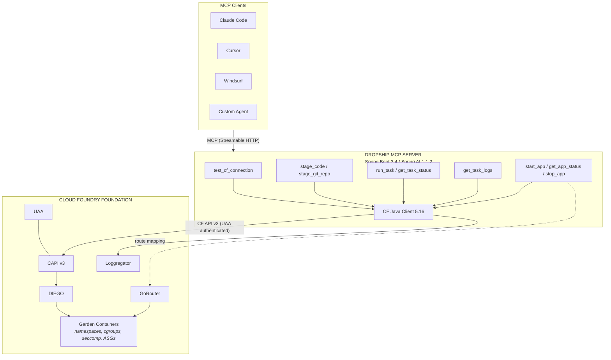
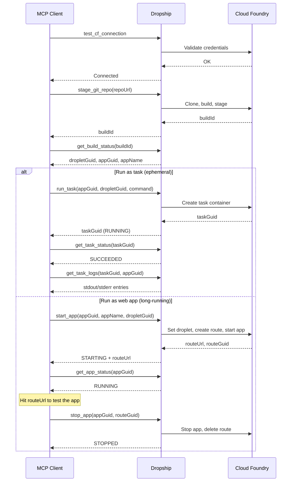

# Dropship


**Enterprise-governed code execution for AI agents via Cloud Foundry**

## About

AI coding agents need to compile and run code, but doing so on a developer's laptop offers no audit trail, resource governance, or credential isolation — and sending code to a vendor sandbox may violate data residency requirements. Dropship fills this gap by letting AI agents execute code inside an organization's Cloud Foundry foundation where identity, authorization, isolation, audit, network policy, and cost attribution are all platform-enforced.

Dropship is a [Model Context Protocol](https://modelcontextprotocol.io/) (MCP) server that works with any MCP client — Claude Code, Cursor, Windsurf, or custom agents. Every execution runs with UAA-federated identity, org/space quota enforcement, ASG network policies, and full CF Audit Event trails.

## Key Features

- **Stage from source or git** — Upload source bundles or point to a public git repo; CF buildpacks handle compilation for Java, Node.js, Python, Go, and more
- **Ephemeral task execution** — Run commands in isolated Garden containers that are destroyed after completion
- **Long-running web apps** — Start staged applications as web processes with auto-provisioned HTTP routes for integration testing
- **Structured log retrieval** — Fetch timestamped, source-separated stdout/stderr from Loggregator Log Cache
- **Per-user credentials** — Each MCP client passes its own CF credentials via HTTP headers; no shared service account
- **Enterprise isolation** — Every execution is governed by CF org/space quotas, ASGs, RBAC, and audit events

## MCP Tools

Dropship exposes 10 MCP tools organized into four workflows:

### Connection

| Tool | Description |
|------|-------------|
| `test_cf_connection` | Validate CF API reachability, authentication, and org/space resolution before staging |

### Staging

| Tool | Description |
|------|-------------|
| `stage_code` | Upload a base64-encoded source bundle and compile it through the CF buildpack pipeline |
| `stage_git_repo` | Clone a public git repo on the server, build it, and stage through CF buildpacks (async — poll with `get_build_status`) |
| `get_build_status` | Poll the status of an async `stage_git_repo` build |

### Task Execution

| Tool | Description |
|------|-------------|
| `run_task` | Execute a command in an isolated Garden container provisioned from a staged droplet |
| `get_task_status` | Poll task state: RUNNING, SUCCEEDED, or FAILED |
| `get_task_logs` | Retrieve structured stdout/stderr from Loggregator Log Cache |

### App Lifecycle

| Tool | Description |
|------|-------------|
| `start_app` | Start a staged application as a long-running web process with an auto-provisioned HTTP route |
| `get_app_status` | Poll app process state: STARTING, RUNNING, CRASHED, or STOPPED |
| `stop_app` | Stop a running application and clean up its route |

## Architecture



### Typical Workflow



## Built With

| Component | Version |
|-----------|---------|
| [Spring Boot](https://spring.io/projects/spring-boot) | 3.4.3 |
| [Spring AI](https://docs.spring.io/spring-ai/reference/) | 1.1.2 |
| [Spring AI MCP Server](https://docs.spring.io/spring-ai/reference/api/mcp/mcp-server-boot-starter-docs.html) | 1.1.2 (via BOM) |
| [MCP Annotations](https://github.com/spring-ai-community/mcp-annotations) | 0.8.0 |
| [CF Java Client](https://github.com/cloudfoundry/cf-java-client) | 5.16.0 |
| [JGit](https://www.eclipse.org/jgit/) | 7.1.0 |
| Java | 21 |

WebFlux is used because `cf-java-client` is Reactor-based — fully reactive end-to-end.

## Getting Started

### Prerequisites

- Java 21 (JDK)
- Maven 3.9+
- A Cloud Foundry foundation with org/space access
- CF CLI (`cf`) installed and targeted

### Build

```bash
mvn clean package
```

### Deploy to Cloud Foundry

```bash
cp vars.yml.example vars.yml
# Edit vars.yml with your CF API URL and sandbox org/space
cf push -f manifest.yml --vars-file vars.yml
```

See [docs/deployment.md](docs/deployment.md) for detailed deployment instructions and [docs/cf-setup.md](docs/cf-setup.md) for CF foundation prerequisites.

### Connect an MCP Client

**Claude Code** (`~/.claude/managed-mcp.json`):

```json
{
  "dropship": {
    "type": "http",
    "url": "https://dropship-mcp.apps.your-domain.com/mcp"
  }
}
```

**Cursor / Windsurf** (`.cursor/mcp.json` or `.windsurf/mcp.json`):

```json
{
  "mcpServers": {
    "dropship": {
      "url": "https://dropship-mcp.apps.your-domain.com/mcp"
    }
  }
}
```

See [docs/client-setup.md](docs/client-setup.md) for all client configurations and curl examples.

### Server Instructions (Automatic)

Dropship uses the MCP protocol's `instructions` field to automatically teach
connected AI agents how to orchestrate its tools. When any client connects, it
receives workflow patterns, parameter threading rules, buildpack guidance, and
error recovery strategies — no client-side rules files or skills needed.

This is configured via `spring.ai.mcp.server.instructions` in `application.yml`
and works with any MCP-compliant client.

## Configuration

| Property | Env Variable | Default | Description |
|----------|-------------|---------|-------------|
| `dropship.sandbox-org` | `DROPSHIP_SANDBOX_ORG` | — | CF org for agent workloads |
| `dropship.sandbox-space` | `DROPSHIP_SANDBOX_SPACE` | — | CF space within the org |
| `dropship.cf-api-url` | `CF_API_URL` | — | CF API endpoint |
| `dropship.max-task-memory-mb` | — | `2048` | Hard cap on task memory (MB) |
| `dropship.max-task-disk-mb` | — | `4096` | Hard cap on task disk (MB) |
| `dropship.max-task-timeout-seconds` | — | `900` | Maximum task duration (15 min) |
| `dropship.default-task-memory-mb` | — | `512` | Default memory when not specified |
| `dropship.default-staging-memory-mb` | — | `1024` | Default memory for staging builds |
| `dropship.default-staging-disk-mb` | — | `2048` | Default disk for staging builds |
| `dropship.app-name-prefix` | — | `dropship-` | Prefix for ephemeral app names |

Per-user CF credentials are passed via MCP HTTP headers (`cf-apihost`, `cf-username`, `cf-password`, `cf-org`, `cf-space`).

## Testing

### Unit Tests

```bash
mvn test
```

Runs 215 unit tests covering all tools, services, models, and configuration classes. Integration tests are excluded by default.

### Integration Tests

Integration tests run against a real CF foundation:

```bash
mvn verify -Pintegration
```

Requires `CF_API_URL`, `DROPSHIP_SANDBOX_ORG`, and `DROPSHIP_SANDBOX_SPACE` to be set, plus valid CF credentials.

### End-to-End Verification

A curl-based E2E test exercises the complete staging, execution, and log retrieval workflow:

```bash
DROPSHIP_URL=https://dropship-mcp.apps.example.com/mcp ./scripts/e2e-curl-test.sh
```

## Enterprise Security

| Layer | Mechanism | What It Prevents |
|-------|-----------|------------------|
| **Identity** | Per-user CF credentials via MCP headers | Anonymous/unattributed execution |
| **Authorization** | RBAC at org/space level | Unauthorized access to production |
| **Isolation** | Garden containers (namespaces, cgroups, seccomp) | Container escape, host compromise |
| **Network** | Application Security Groups (ASGs) | Lateral movement, data exfiltration |
| **Audit** | CF Audit Events to SIEM | Undetected execution, compliance gaps |
| **Cost Control** | Org/space quotas | Runaway resource consumption |
| **Data Residency** | Code never leaves the CF foundation | Regulatory violations (HIPAA, SOC 2, FedRAMP) |
| **Credentials** | Service bindings via VCAP_SERVICES | Agent exfiltrating secrets |

## Project Structure

```
src/main/java/com/baskette/dropship/
├── DropshipApplication.java
├── config/
│   ├── CloudFoundryConfig.java           # CF client beans
│   ├── CloudFoundryHealthCheck.java      # Startup connectivity verification
│   ├── DropshipProperties.java           # @ConfigurationProperties
│   ├── McpTransportConfig.java           # MCP HTTP header extraction
│   └── SpaceResolverHealthIndicator.java # /actuator/health contributor
├── tool/
│   ├── TestConnectionTool.java           # test_cf_connection
│   ├── StageCodeTool.java                # stage_code
│   ├── StageGitRepoTool.java             # stage_git_repo
│   ├── GetBuildStatusTool.java           # get_build_status
│   ├── RunTaskTool.java                  # run_task
│   ├── GetTaskStatusTool.java            # get_task_status
│   ├── GetTaskLogsTool.java              # get_task_logs
│   ├── StartAppTool.java                 # start_app
│   ├── GetAppStatusTool.java             # get_app_status
│   ├── StopAppTool.java                  # stop_app
│   └── CfCredentialHelper.java           # Per-user credential extraction
├── model/
│   ├── AppResult.java                    # App lifecycle outcome
│   ├── StagingResult.java                # Staging outcome
│   ├── TaskResult.java                   # Task execution outcome
│   ├── TaskLogs.java                     # Structured log entries
│   └── ConnectionTestResult.java         # Connection test outcome
└── service/
    ├── AppService.java                   # Route creation, app start/stop
    ├── StagingService.java               # App creation, build lifecycle
    ├── TaskService.java                  # Droplet assignment, task execution
    ├── GitCloneService.java              # Remote git clone for stage_git_repo
    ├── BuildTracker.java                 # Async build tracking
    ├── LogService.java                   # Loggregator log retrieval
    └── SpaceResolver.java               # Org/space GUID resolution
```

## Documentation

| Document | Description |
|----------|-------------|
| [docs/cf-setup.md](docs/cf-setup.md) | CF foundation setup: UAA client, org/space, quotas, ASGs |
| [docs/deployment.md](docs/deployment.md) | Deployment guide with preflight checklist |
| [docs/client-setup.md](docs/client-setup.md) | MCP client configuration and sample session |
| [dropship.md](dropship.md) | Full design specification |

## Roadmap

- [x] Core staging and task execution tools (`stage_code`, `run_task`, `get_task_logs`)
- [x] Git repo staging (`stage_git_repo`, `get_build_status`)
- [x] Task status polling (`get_task_status`)
- [x] Connection validation (`test_cf_connection`)
- [x] Per-user credential model via MCP headers
- [x] Long-running web app lifecycle (`start_app`, `get_app_status`, `stop_app`)
- [ ] Rate limiting and task queuing
- [ ] Droplet caching across sessions
- [ ] Metrics and observability dashboard
- [ ] Multi-space RBAC with role-based tool access
- [ ] Service binding passthrough
- [ ] Cost attribution and chargeback

## Contributing

Contributions are welcome!

1. Fork the repository
2. Create a feature branch (`git checkout -b feature/amazing-feature`)
3. Commit your changes (`git commit -m 'Add amazing feature'`)
4. Push to the branch (`git push origin feature/amazing-feature`)
5. Open a Pull Request

## License

Distributed under the MIT License. See [LICENSE](LICENSE) for details.

---

*Dropship: Drop code safely. Ship results back.*
