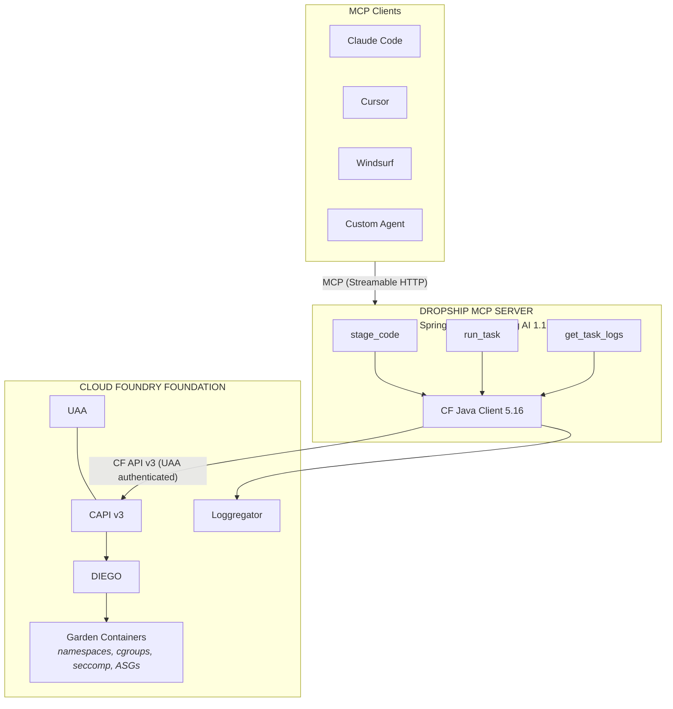

# Dropship


**Enterprise-governed code execution for AI agents via Cloud Foundry**

Dropship is a [Model Context Protocol](https://modelcontextprotocol.io/) (MCP) server that lets AI agents — Claude Code, Cursor, Windsurf, or any MCP client — compile, execute, and observe code inside enterprise-managed Cloud Foundry containers. Every execution runs with UAA-federated identity, org/space quota enforcement, ASG network policies, and full CF Audit Event trails.

---

## The Problem

AI coding agents execute code in one of two places, and neither satisfies enterprise requirements:

| Approach | Limitation |
|---|---|
| **Developer's local machine** | No centralized audit trail, no resource governance, no credential isolation. A prompt injection can exfiltrate `~/.ssh` or `~/.aws`. |
| **Vendor cloud sandbox** | Code leaves the enterprise perimeter. Data residency (HIPAA, SOC 2, FedRAMP) may prohibit this. No control over network policies or service bindings. |

**Dropship fills the gap:** AI agents execute code inside the organization's Cloud Foundry foundation where identity, authorization, isolation, audit, network policy, and cost attribution are all platform-enforced.

---

## How It Works

Dropship exposes three MCP tools that map to Cloud Foundry primitives:

### `stage_code`

Upload source code and compile it through CF's buildpack pipeline. Catches dependency errors and compilation failures before execution.

```
Agent -> stage_code(source, "java_buildpack") -> CF creates ephemeral app ->
buildpack compiles -> produces droplet -> returns droplet GUID + staging logs
```

### `run_task`

Execute a command in an isolated Garden container provisioned from a staged droplet. Diego schedules the task to a Cell, Garden enforces namespace/cgroup/seccomp isolation and ASG network policies.

```
Agent -> run_task(dropletGuid, "mvn test", 512MB) -> Diego creates container ->
command executes -> container destroyed -> returns exit code + task GUID
```

### `get_task_logs`

Retrieve structured stdout/stderr from Loggregator. Logs persist independently of the container lifecycle.

```
Agent -> get_task_logs(taskGuid) -> Loggregator Log Cache ->
returns timestamped, source-separated log entries
```

---

## Architecture



---

## Technology Stack

| Component | Artifact | Version |
|---|---|---|
| Spring Boot | `spring-boot-starter-webflux` | 3.4.3 |
| Spring AI | `spring-ai-bom` | 1.1.2 |
| MCP Server | `spring-ai-starter-mcp-server-webflux` | 1.1.2 (via BOM) |
| MCP Annotations | `org.springaicommunity:mcp-annotations` | 0.8.0 |
| CF Client | `cloudfoundry-client-reactor` | 5.16.0.RELEASE |
| CF Operations | `cloudfoundry-operations` | 5.16.0.RELEASE |
| Java | OpenJDK | 21 |

WebFlux is used because `cf-java-client` is Reactor-based — fully reactive end-to-end.

---

## Quick Start

### Prerequisites

- Java 21 (JDK)
- Maven 3.9+
- A Cloud Foundry foundation with admin access (for UAA client setup)

### Build

```bash
mvn clean package
```

### Deploy to Cloud Foundry

```bash
cp vars.yml.example vars.yml
# Edit vars.yml with your CF API URL, UAA credentials, and sandbox org/space
cf push -f manifest.yml --vars-file vars.yml
```

See [docs/deployment.md](docs/deployment.md) for detailed deployment instructions and [docs/cf-setup.md](docs/cf-setup.md) for CF foundation prerequisites.

### Connect an MCP Client

**Claude Code** (`~/.claude/managed-mcp.json`):

```json
{
  "dropship": {
    "type": "http",
    "url": "https://dropship-mcp.apps.your-domain.com/mcp"
  }
}
```

**Cursor / Windsurf** (`.cursor/mcp.json` or `.windsurf/mcp.json`):

```json
{
  "mcpServers": {
    "dropship": {
      "url": "https://dropship-mcp.apps.your-domain.com/mcp"
    }
  }
}
```

See [docs/client-setup.md](docs/client-setup.md) for all client configurations and a sample session transcript.

---

## Configuration

All Dropship settings are configurable via environment variables or `application.yml`:

| Property | Env Variable | Default | Description |
|---|---|---|---|
| `dropship.sandbox-org` | `DROPSHIP_SANDBOX_ORG` | — | CF org for agent workloads |
| `dropship.sandbox-space` | `DROPSHIP_SANDBOX_SPACE` | — | CF space within the org |
| `dropship.cf-api-url` | `CF_API_URL` | — | CF API endpoint |
| `dropship.max-task-memory-mb` | — | `2048` | Hard cap on task memory (MB) |
| `dropship.max-task-disk-mb` | — | `4096` | Hard cap on task disk (MB) |
| `dropship.max-task-timeout-seconds` | — | `900` | Maximum task duration (15 min) |
| `dropship.default-task-memory-mb` | — | `512` | Default memory when not specified |
| `dropship.default-staging-memory-mb` | — | `1024` | Default memory for staging builds |
| `dropship.default-staging-disk-mb` | — | `2048` | Default disk for staging builds |
| `dropship.app-name-prefix` | — | `dropship-` | Prefix for ephemeral app names |

UAA credentials are set via `CF_CLIENT_ID` and `CF_CLIENT_SECRET` environment variables.

---

## Testing

### Unit Tests

```bash
mvn test
```

Runs 97 unit tests covering all tools, services, models, and configuration classes. Integration tests are excluded by default.

### Integration Tests

Integration tests run against a real CF foundation:

```bash
mvn verify -Pintegration
```

Requires `CF_CLIENT_ID`, `CF_CLIENT_SECRET`, `CF_API_URL`, `DROPSHIP_SANDBOX_ORG`, and `DROPSHIP_SANDBOX_SPACE` to be set.

### End-to-End Verification

A curl-based E2E test exercises the complete `stage_code` -> `run_task` -> `get_task_logs` workflow:

```bash
DROPSHIP_URL=https://dropship-mcp.apps.example.com/mcp ./scripts/e2e-curl-test.sh
```

Use `--verbose` to print raw curl commands for debugging.

---

## Enterprise Security

| Layer | Mechanism | What It Prevents |
|---|---|---|
| **Identity** | UAA client credentials, federated to enterprise IdP | Anonymous/unattributed execution |
| **Authorization** | RBAC at org/space level | Unauthorized access to production |
| **Isolation** | Garden containers (namespaces, cgroups, seccomp) | Container escape, host compromise |
| **Network** | Application Security Groups (ASGs) | Lateral movement, data exfiltration |
| **Audit** | CF Audit Events to SIEM | Undetected execution, compliance gaps |
| **Cost Control** | Org/space quotas | Runaway resource consumption |
| **Data Residency** | Code never leaves the CF foundation | Regulatory violations (HIPAA, SOC 2, FedRAMP) |
| **Credentials** | Service bindings via VCAP_SERVICES | Agent exfiltrating secrets |

---

## Why Not Docker?

| Concern | Docker | Dropship (CF) |
|---|---|---|
| Identity/auth | Docker daemon (root-equivalent) | UAA-federated RBAC |
| Resource governance | Manual `--memory` flags | Org/space quotas enforced platform-wide |
| Network isolation | Manual iptables | Application Security Groups (ASGs) |
| Audit trail | Docker daemon logs (if enabled) | CF Audit Events to SIEM |
| Credential management | Mounted `.env` files | Service bindings (VCAP_SERVICES) |
| Multi-tenancy | Separate daemons | Org / Space / App RBAC hierarchy |
| Scaling | Manual Swarm/Compose | Diego Auctioneer across 250+ Cells |
| Compliance | "Trust me, it's in Docker" | SOC 2-auditable CF Audit Events |

---

## Project Structure

```
src/main/java/com/baskette/dropship/
├── DropshipApplication.java
├── config/
│   ├── CloudFoundryConfig.java           # CF client beans, UAA auth
│   ├── CloudFoundryHealthCheck.java      # Startup connectivity verification
│   ├── DropshipProperties.java           # @ConfigurationProperties
│   └── SpaceResolverHealthIndicator.java # /actuator/health contributor
├── tool/
│   ├── StageCodeTool.java                # @McpTool stage_code
│   ├── RunTaskTool.java                  # @McpTool run_task
│   └── GetTaskLogsTool.java              # @McpTool get_task_logs
├── model/
│   ├── StagingResult.java                # Staging outcome record
│   ├── TaskResult.java                   # Task execution outcome
│   └── TaskLogs.java                     # Structured log entries
└── service/
    ├── StagingService.java               # App creation, build lifecycle, log retrieval
    ├── TaskService.java                  # Droplet assignment, task execution, polling
    ├── LogService.java                   # Loggregator log retrieval and filtering
    └── SpaceResolver.java               # Org/space GUID resolution at startup
```

---

## Documentation

| Document | Description |
|---|---|
| [docs/cf-setup.md](docs/cf-setup.md) | CF foundation setup: UAA client, org/space, quotas, ASGs |
| [docs/deployment.md](docs/deployment.md) | Deployment guide with preflight checklist |
| [docs/client-setup.md](docs/client-setup.md) | MCP client configuration and sample session |
| [dropship.md](dropship.md) | Full design specification |
| [PLAN.md](PLAN.md) | Phase 1 implementation plan |

---

## Roadmap

| Phase | Focus | Status |
|---|---|---|
| **Phase 1: Foundation (MVP)** | Three core tools, CF integration, deployment manifest | In progress |
| **Phase 2: Hardening** | Rate limiting, task queuing, droplet caching, metrics | Planned |
| **Phase 3: Enterprise** | Multi-space RBAC, service binding passthrough, cost attribution | Planned |
| **Phase 4: Worldmind** | Centurion toolkit adapter, parallel test orchestration | Planned |

---

## Ecosystem Positioning

Corby Page's [`cloud-foundry-mcp`](https://github.com/corby-page): **"Talk to CF about your apps."** (Management plane)

Dropship: **"Use CF to safely run the code your AI agents write."** (Execution plane)

Complementary, not competitive.

---

## License

Distributed under the MIT License. See [LICENSE](LICENSE) for details.

---

*Dropship: Drop code safely. Ship results back.*
